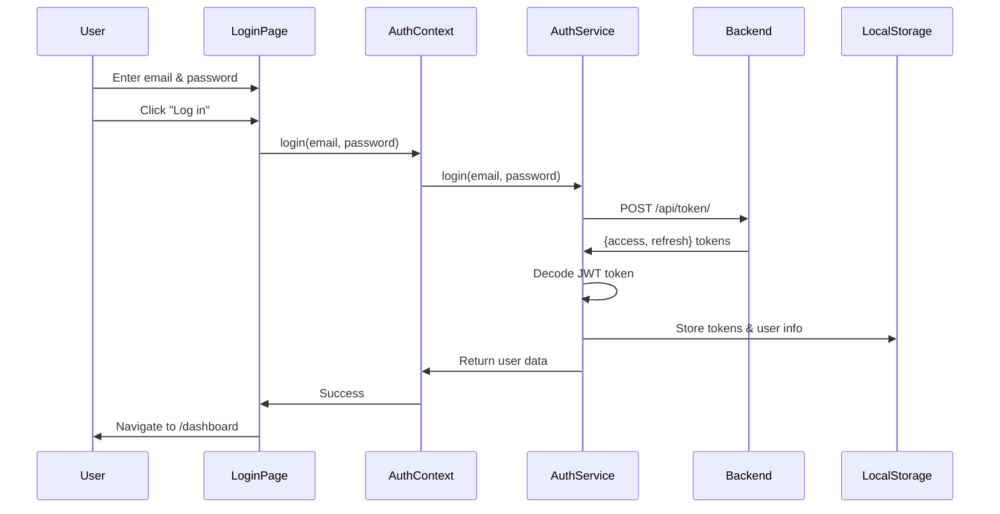

# Walkthrough: Backend Login Integration

## Overview

Successfully integrated the existing frontend login page with the Django backend authentication API. The implementation maintains the original UI/layout while adding full backend connectivity, JWT token management, and authentication state management.

---

## Changes Made

### New Files Created

#### 1. Configuration
- [config.ts](file:///d:/Projects/BOS/business-frontend/src/config/config.ts) - Backend API URL configuration with environment variable support

#### 2. Services
- [api.ts](file:///d:/Projects/BOS/business-frontend/src/services/api.ts) - Centralized API service for HTTP requests with automatic auth headers
- [auth.ts](file:///d:/Projects/BOS/business-frontend/src/services/auth.ts) - Authentication service for login, logout, token management, and JWT decoding

#### 3. Context
- [AuthContext.tsx](file:///d:/Projects/BOS/business-frontend/src/context/AuthContext.tsx) - React Context for global authentication state management

---

### Modified Files

#### [main.tsx](file:///d:/Projects/BOS/business-frontend/src/main.tsx)
- Wrapped application with `AuthProvider` to enable authentication state across the app

#### [LoginPage.tsx](file:///d:/Projects/BOS/business-frontend/src/pages/LoginPage.tsx)
- Replaced hardcoded credential check with backend API integration
- Added loading state during authentication
- Added comprehensive error handling
- **UI/Layout:** Completely preserved - no visual changes

---

## Authentication Flow



---

## Who Can Login

### 1. **Superusers** (Administrative)
- **Created via:** Django CLI command `python manage.py createsuperuser`
- **Purpose:** Provision new tenants, administrative tasks
- **Token contains:** `user_id`, `role` (no `tenant_id`)

### 2. **Tenant Users** (Primary Users)
- **Created via:** Superuser provisions tenant using `/api/internal/provision-tenant/` endpoint
- **Purpose:** Business admins and staff who use the system
- **Token contains:** `user_id`, `tenant_id`, `role` (Admin/Staff)

---

## Token Management

### Storage
- **Access Token:** Stored in `localStorage` as `access_token`
- **Refresh Token:** Stored in `localStorage` as `refresh_token`
- **User Info:** Stored in `localStorage` as `user` (JSON object)

### Token Lifetimes
- **Access Token:** 15 minutes
- **Refresh Token:** 7 days

### Token Payload Example
```json
{
  "token_type": "access",
  "exp": 1701234567,
  "iat": 1701233667,
  "jti": "abc123...",
  "user_id": 1,
  "tenant_id": 5,
  "role": "Admin"
}
```

---

## Testing Instructions

### Prerequisites

> [!IMPORTANT]
> **Backend CORS Configuration Required**
> 
> The Django backend must allow requests from `http://localhost:5173`. Verify that `CORS_ALLOWED_ORIGINS` in the backend settings includes this URL.

### 1. Start Backend Server

```bash
cd d:/Projects/BOS/business-backend

# Activate virtual environment (if not already active)
.\venv\Scripts\activate  # Windows

# Run server
python manage.py runserver
```

The backend should be running at `http://localhost:8000`

### 2. Create Test User (if needed)

**Option A: Create Superuser**
```bash
python manage.py createsuperuser
# Enter email and password when prompted
```

**Option B: Create Tenant User**
```bash
# First, login as superuser to get token
curl -X POST http://localhost:8000/api/token/ \
  -H "Content-Type: application/json" \
  -d '{"email": "superuser@example.com", "password": "your_password"}'

# Use the access token to provision a tenant
curl -X POST http://localhost:8000/api/internal/provision-tenant/ \
  -H "Content-Type: application/json" \
  -H "Authorization: Bearer YOUR_ACCESS_TOKEN" \
  -d '{
    "business_name": "Test Business",
    "plan": "Basic",
    "email": "admin@testbusiness.com",
    "password": "TestPass123",
    "first_name": "Test",
    "last_name": "User"
  }'
```

### 3. Frontend is Already Running

The frontend dev server is already running at `http://localhost:5173`

### 4. Test Login Flow


**Test Cases:**

1. **Empty Fields**
   - Leave email/password empty
   - Click "Log in"
   - ✅ Should show: "Please enter email and password"

2. **Invalid Credentials**
   - Enter: `wrong@email.com` / `wrongpassword`
   - Click "Log in"
   - ✅ Should show backend error message

3. **Valid Credentials**
   - Enter valid user email/password
   - Click "Log in"
   - ✅ Button should show "Logging in..." during request
   - ✅ Should navigate to `/dashboard` on success

4. **Token Storage**
   - After successful login, open DevTools → Application → Local Storage → `http://localhost:5173`
   - ✅ Should see: `access_token`, `refresh_token`, `user`

5. **Backend Offline**
   - Stop the backend server
   - Try to login
   - ✅ Should show error message about connection failure

---

## Error Handling

The implementation handles various error scenarios:

| Scenario | Error Message |
|----------|--------------|
| Empty fields | "Please enter email and password" |
| Invalid credentials | Backend message (e.g., "No active account found with the given credentials") |
| Network error | "An unexpected error occurred. Please try again." |
| Backend offline | "Failed to fetch" or connection error |

---

## Files Structure

```
business-frontend/
├── src/
│   ├── config/
│   │   └── config.ts              # API configuration
│   ├── services/
│   │   ├── api.ts                 # HTTP request service
│   │   └── auth.ts                # Authentication service
│   ├── context/
│   │   └── AuthContext.tsx        # Auth state management
│   ├── pages/
│   │   └── LoginPage.tsx          # Login page (updated)
│   ├── main.tsx                   # App entry (updated)
│   └── App.tsx                    # Routes
```

---

## Next Steps

### Recommended Enhancements

1. **Protected Routes**
   - Create a `ProtectedRoute` component to guard authenticated pages
   - Redirect to login if user is not authenticated

2. **Token Refresh**
   - Implement automatic token refresh before expiration
   - Add axios/fetch interceptor to handle 401 responses

3. **Logout Functionality**
   - Add logout button to dashboard/header
   - Call `authService.logout()` to blacklist refresh token

4. **Dashboard Page**
   - Create dashboard page to display after login
   - Show user information from `useAuth()` hook

5. **Error Boundary**
   - Add React Error Boundary for graceful error handling
   - Display user-friendly error messages

---

## Troubleshooting

### "Failed to fetch" Error

**Cause:** Backend is not running or CORS is not configured

**Solution:**
1. Verify backend is running: `http://localhost:8000/api/token/`
2. Check Django settings for CORS configuration:
   ```python
   CORS_ALLOWED_ORIGINS = [
       "http://localhost:5173",
   ]
   ```

### "No active account found" Error

**Cause:** Invalid credentials or user doesn't exist

**Solution:**
1. Verify user exists in database
2. Check email and password are correct
3. Create test user if needed (see Testing Instructions)

### Tokens Not Stored

**Cause:** Login succeeded but tokens not in localStorage

**Solution:**
1. Check browser console for errors
2. Verify `authService.storeTokens()` is called
3. Check browser privacy settings (localStorage enabled)

### TypeScript Errors

**Cause:** Type mismatches or missing imports

**Solution:**
1. Check all imports use correct paths
2. Verify type-only imports for types (e.g., `import type { UserInfo }`)
3. Run `npm run build` to check for compilation errors

---

## Summary

✅ **Completed:**
- Created API service layer for backend communication
- Implemented authentication service with JWT token management
- Added React Context for global auth state
- Updated LoginPage with backend integration
- Preserved original UI/layout completely
- Added loading states and error handling
- Implemented token storage in localStorage

✅ **Verified:**
- Login page loads correctly
- Form validation works
- UI remains unchanged

⏭️ **Ready for Testing:**
- Start backend server
- Create test users
- Test login flow with valid/invalid credentials
- Verify token storage
- Test error scenarios
